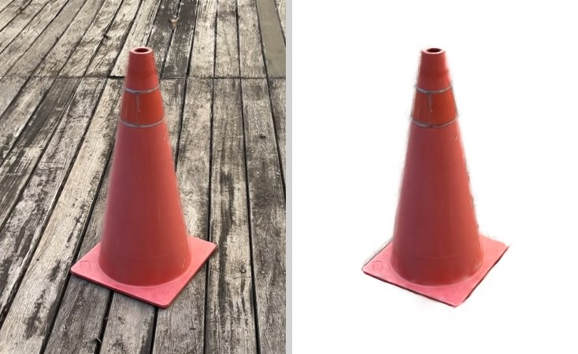

# 3D Gaussian Splatting Object Extraction

Cut one object out of a trained 3D Gaussian Splatting scene and save it as a standalone PLY. Click the object in the viewer, SAM2 masks the rendered views, and only the object's Gaussians are kept. Source photos are never read.



## How it works

1. Open a PLY and look around.
2. Click the object in a few views. SAM2 draws the mask, Enter adds the view.
3. Extract. The masks are lifted to Gaussians, then the selection is rendered on its own to drop pieces outside the masks.
4. Export the object.

## Installation

Needs a CUDA GPU and the environment used to train Graphdeco 3DGS, that is PyTorch and diff_gaussian_rasterization. The script builds .venv-gpu on top of it, installs requirements.txt and fetches the SAM2 checkpoint.

```bash
GS_PYTHON=/path/to/gs_train/bin/python scripts/setup_env.sh
source .venv-gpu/bin/activate
```

## The viewer

The input is the point_cloud.ply a Graphdeco 3DGS run writes.

```bash
gs-object-extraction-gui path/to/point_cloud.ply
```


| Input | Action |
| --- | --- |
| Left drag, right drag, wheel | Orbit, pan, zoom |
| Double-click | Put the rotation centre under the cursor |
| S | Select mode on and off |
| Left click, right click | Object point, background point |
| Backspace, Esc, Enter | Undo a point, clear the points, add the view |
| Ctrl+E, Ctrl+Shift+S | Extract the object, export it as a PLY |

Mark the object all the way around, about sixteen views, with the camera kept low; steep views drag in the ground behind the object. Mark around the object does that for you from the views you have marked already: it is experimental, so look at what it marked, and press it again if the object still comes out cut short. Edge trim pulls in the Gaussians that reach past the masks, which is what leaves a halo around the object; set it to 1.00 to keep them as they are. Two limits stay: the underside no view ever saw comes out empty, and thin structures such as leaves come out slightly thinned at the edges.

## Tests

The second line runs the CUDA and SAM2 tests, which the first one skips.

```bash
python3 -m pytest -q
GS_OBJECT_EXTRACTION_TEST_CUDA=1 PYTEST_DISABLE_PLUGIN_AUTOLOAD=1 python -m pytest -q
```

## License

Apache 2.0, see LICENSE. The renderer this tool needs, diff_gaussian_rasterization from INRIA and MPII, is licensed for non-commercial research use; commercial use needs their permission.
