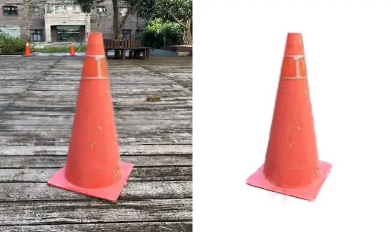
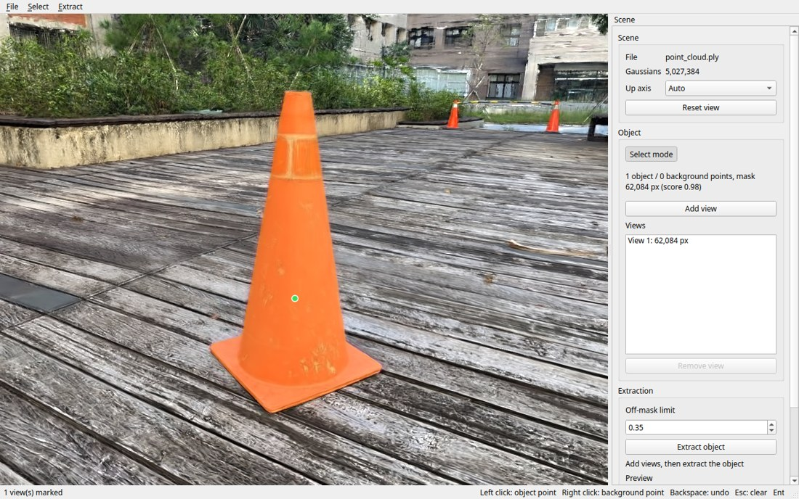

# 3D Gaussian Splatting Object Extraction

Extract an object from a trained 3D Gaussian Splatting scene and export it as a standalone PLY. Open the scene in the viewer, click the object from a few angles, and SAM2 segments those views to identify the object's Gaussians. No source photos are needed.



## Requirements

- A CUDA GPU, Python 3.10–3.12 and the CUDA Toolkit.
- A scene already trained with [Graphdeco 3DGS](https://github.com/graphdeco-inria/gaussian-splatting). The viewer opens its `point_cloud.ply`, normally at `output/<scene>/point_cloud/iteration_30000/point_cloud.ply`. Training a scene is out of scope for this tool.

## Installation

From the repository root, install PyTorch for your CUDA version (the index URL below is for CUDA 12.8), then the tool:

```bash
python3 -m venv .venv-gpu
source .venv-gpu/bin/activate
pip install --upgrade pip setuptools wheel
pip install torch torchvision --index-url https://download.pytorch.org/whl/cu128
SAM2_BUILD_CUDA=0 pip install --no-build-isolation -r requirements.txt
pip install --no-deps -e .
```

The SAM2 checkpoint (about 300 MB) downloads on first use into `~/.cache/gs-object-extraction/checkpoints/`. A copy already in the repository's `checkpoints/` folder is used instead.

gsplat compiles its CUDA kernels the first time a scene is opened, which takes a minute or two.

## Usage

The viewer is the whole tool. With the environment active:

```bash
gs-object-extraction-gui
```

*Open PLY...* in the File menu (Ctrl+O) opens a scene. A path on the command line opens it straight away, which saves the dialog when returning to the same scene.



1. **Frame the object.** Left drag to orbit, right drag to pan, wheel to zoom. Double-click the object to put the rotation centre on it, so orbiting keeps it in view.
2. **Mark a view.** Press **S** for select mode, left-click the object, and SAM2 overlays a mask. Right-click anything the mask wrongly includes to push it back out. When the mask covers the object, press **Enter** to add the view. It joins the *Views* list in the right-hand panel.
3. **Repeat from other angles.** About 16 views around the object is a useful starting point. Keep the camera low to reduce the ground included in the masks.
4. **Extract.** Press **Ctrl+E** (or *Extract object* in the panel). The viewport switches to a preview of the object alone, which you can orbit like the scene, and the panel reports how many Gaussians were selected, removed and kept.
5. **Export.** Press **Ctrl+Shift+S** to write the object as a PLY. The dialog offers `<scene>_object.ply` next to the source scene.

### Keys

| Input | Navigating | Select mode (S) |
| --- | --- | --- |
| Left drag, right drag, wheel | Orbit, pan, zoom | Orbit, pan, zoom |
| Left click | — | Add an object point |
| Right click | — | Add a background point |
| Double-click | Centre rotation under the cursor | — |
| Backspace, Esc | — | Undo a point, clear the points |
| Enter | — | Add the view |
| Ctrl+E, Ctrl+Shift+S | Extract the object, export a PLY | Extract the object, export a PLY |

### Tuning the result

Most of the panel says what it does, and the app carries tooltips. Three controls are worth knowing in advance, because they change the object you get:

- **Mark around the object (experimental)** (*Object*) needs one marked view to start from, then marks a ring of views around the object on its own. Review the result and press it again to add another ring; each run keeps what is already marked.
- **Off-mask limit** (*Extraction*) is read when extraction starts. Lower drops more Gaussians that stray outside the masks, at the cost of thinner edges. Changing it means extracting again.
- **Edge trim** (*Extraction*) pulls in the Gaussians that reach past the masks and halo the object; `1.00` leaves them as they are. It applies to a finished object without re-extracting, and changes what is exported, not just the preview.

Surfaces missing from the source scene cannot be recovered. An object photographed from one side stays hollow on the other, and thin structures such as leaves may lose detail at the edges.

## License

Licensing terms can be found in the [License File](LICENSE).

Third-party dependencies are distributed under their own licenses.
