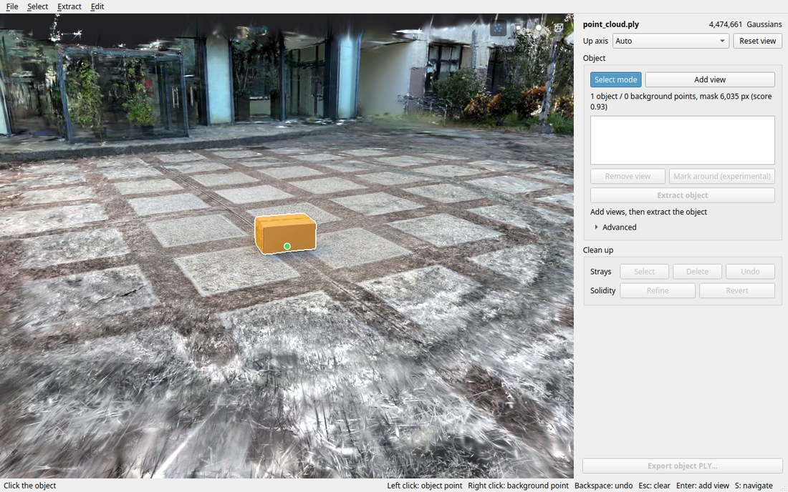

# 3D Gaussian Splatting Object Extraction

Extract an object from a trained 3D Gaussian Splatting scene and export it as a standalone PLY. Open the scene in the viewer, click the object from a few angles, and SAM2 segments those views to identify the object's Gaussians. No source photos are needed.


## Requirements

- A CUDA GPU, Python 3.10–3.12 and the CUDA Toolkit.
- A scene already trained with [Graphdeco 3DGS](https://github.com/graphdeco-inria/gaussian-splatting), opened from its `point_cloud.ply`. Training is out of scope.

## Installation

From the repository root, install PyTorch for your CUDA version (the index URL is for CUDA 12.8), then the tool:

```bash
python3 -m venv .venv-gpu
source .venv-gpu/bin/activate
pip install --upgrade pip setuptools wheel
pip install torch torchvision --index-url https://download.pytorch.org/whl/cu128
SAM2_BUILD_CUDA=0 pip install --no-build-isolation -r requirements.txt
pip install --no-deps -e .
```

The SAM2 checkpoint (about 300 MB) downloads on first use into `~/.cache/gs-object-extraction/checkpoints/`. gsplat compiles its CUDA kernels the first time a scene is opened, which takes a minute or two.

## Usage

```bash
gs-object-extraction-gui [scene.ply]
```

<picture>
  <source media="(prefers-color-scheme: dark)" srcset="docs/images/viewer-dark.jpg">
  
</picture>

1. **Mark views.** Press **S**, click the object, and SAM2 overlays a mask (right-click what it wrongly includes). **Enter** adds the view. Mark about 16 from around the object, camera low; *Mark around* does the ring after one view. Click a view in the list to check it, *Remove view* to drop it.
2. **Extract.** **Ctrl+E**. The view switches to the object alone.
3. **Clean up.** In the object preview, press **S** and drag a box or click to select strays (red); **X** or **Delete** removes them, **Ctrl+Z** undoes. *Refine* refits opacity, colour and size so the object stands solid; set *Edge trim* first. *Revert* undoes it.
4. **Export.** **Ctrl+Shift+S**.

The icons in the top right of the view toggle: Gaussians as blue points, object or scene, white or black background, and a box round the kept Gaussians with its size.

### Controls

The camera moves as in Isaac Sim.

| Input | Action |
| --- | --- |
| Alt + left drag / middle drag / right drag | Orbit / pan / look around |
| Alt + right drag, wheel | Zoom |
| Double-click | Rotation centre under the cursor |
| S, Enter, Backspace, Esc | Select mode, add view, undo point, clear points or selection |
| Shift, Ctrl while selecting | Add to, take away from the selection |
| Ctrl+E, Ctrl+Shift+S | Extract, export |

### Tuning

Under *Advanced* in the *Object* panel:

- **Off-mask limit**: lower drops more stray Gaussians, at the cost of thinner edges. Extract again after changing it.
- **Edge trim**: pulls in Gaussians reaching past the masks; `1.00` leaves them. Applies to the finished object and to the export.

Surfaces missing from the source scene cannot be recovered: an object photographed from one side stays hollow on the other.

## License

[Apache-2.0](LICENSE). [Third-party licenses](third_party/README.md).
